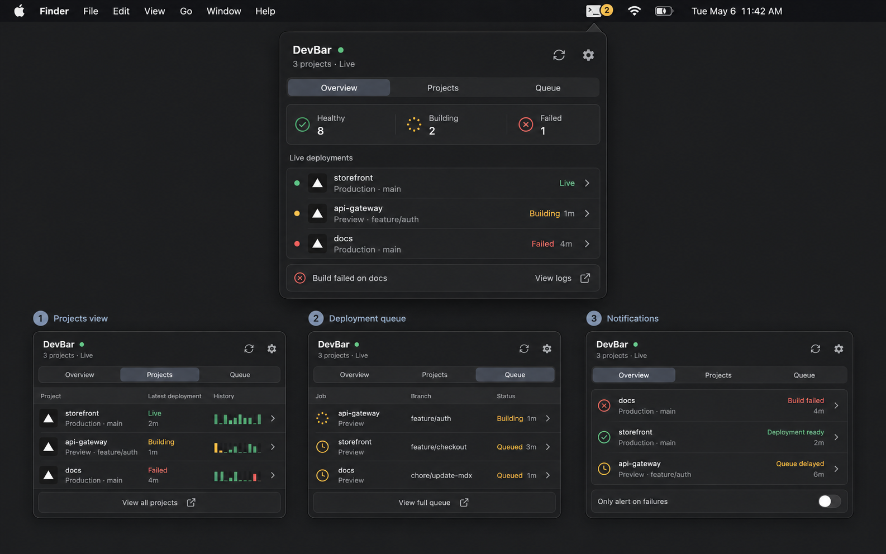

# DevBar

**A quiet native macOS menu-bar command center for deployments and developer services.**



DevBar keeps Vercel project health, live deployments, queues, and important transitions one click away. It is built in SwiftUI, stays out of the Dock, stores credentials in macOS Keychain, and is designed so another service can be added without rewriting the application shell.

> DevBar is under active V1 development. The first signed and notarized DMG has not been published yet.

## V1 highlights

- Overview, Projects, Queue, and Notifications views
- Menu-bar status reflecting the worst current deployment state
- Vercel projects and recent deployment activity
- Adaptive low-energy refresh and recovery after sleep or network changes
- Optional state-change notifications
- Keychain-backed access token storage
- Read-only behavior: no deploy, cancel, rollback, or configuration mutations
- Provider protocol ready for future GitHub, Supabase, Stripe, and uptime integrations
- Native universal application with no third-party runtime dependencies

## Requirements

- macOS 13 Ventura or later
- A Vercel personal access token
- Xcode only when building from source

## Install

The first official release will be distributed as `DevBar-<version>-universal.dmg` from [GitHub Releases](https://github.com/madhangokul/devbar/releases).

1. Download the DMG and its `.sha256` file.
2. Verify the checksum:

   ```sh
   shasum -a 256 -c DevBar-*.dmg.sha256
   ```

3. Open the DMG and drag DevBar into Applications.
4. Launch DevBar. Its icon appears in the menu bar, not the Dock.
5. Open Settings, add a Vercel token, and test the connection.

Official builds are Developer ID signed, notarized by Apple, and stapled for Gatekeeper verification.

## Create a Vercel token

1. Open [Vercel Account Tokens](https://vercel.com/account/settings/tokens).
2. Create a token named `DevBar` with the narrowest account or team scope you need.
3. Choose an expiration date.
4. Paste it into DevBar Settings. Do not put it in a source file or issue.

The optional Team ID is only needed when the token should operate on behalf of a Vercel team. Personal accounts can leave it blank.

To test the Vercel connection without building the app:

```sh
./script/vercel_smoke_test.sh
```

The script reads the token invisibly, does not store it, and displays only a summary of the latest deployments.

## Permissions

DevBar uses outbound internet access and Keychain. Notifications and Launch at Login are optional and requested only when enabled.

It does not require administrator access, Full Disk Access, Accessibility, Screen Recording, Automation, incoming network access, Local Network, camera, microphone, contacts, calendar, or location. See [Privacy and permissions](docs/PRIVACY.md).

## Build from source

```sh
git clone https://github.com/madhangokul/devbar.git
cd devbar
swift test
./script/build_and_run.sh
```

See [Building and releasing](docs/BUILDING_AND_RELEASING.md) for Xcode setup, unsigned local DMGs, Developer ID signing, and notarization.

## Architecture

Providers normalize their APIs into a small common model. Refresh scheduling, caching, notifications, and UI stay provider-neutral.

```text
Provider API --> ToolbarProvider --> RefreshCoordinator --> ToolbarStore --> SwiftUI
                                      |                    |
                                      +--> SnapshotCache   +--> Notifications
```

See [Architecture](docs/ARCHITECTURE.md), the [V1 release plan](docs/V1_RELEASE_PLAN.md), and the deferred [V2 webhook relay design](docs/V2_WEBHOOK_RELAY.md).

## Contributing and security

Contributions are welcome. Read [CONTRIBUTING.md](CONTRIBUTING.md) before proposing a provider or architectural change. Report vulnerabilities privately according to [SECURITY.md](SECURITY.md).

## License

DevBar is available under the [MIT License](LICENSE).
